# Numerical Simulation of Semiconductor's Diffusion-Reaction Process Based on Deep-Learning Methods
 

> **Master's Thesis**  
> Friedrich-Alexander-Universität Erlangen-Nürnberg  
> Supervisors: Prof. Daniel Tenbrinck (FAU) & Dr. Christopher Straub (Fraunhofer-IISB)  
> Author: Xuepeng Cheng  
> Janurary 2025  

## 📜 Abstract
In this project, numerical simulation of the diffusion reaction process of nickel (Ni) with silicon carbide (SiC) is realized based on the physical information neural network (PINN) framework. Combining random Fourier feature embedding, self-attention mechanism and multilayer perceptron (MLP), the training loss and L2 error are reduced. The innovative application of KAN (Kolmogorov-Arnold Networks) and its variant Chebyshev-KAN in PINN is also explored.

## 🌟 Key Features
- **PINN framework improvement**  
  Deep learning model based on physical constraints for coupled multi-physics field simulation.
=======
- **PINN framework improvement** 
 [Reference: PINNs - Raissi](https://github.com/maziarraissi/PINNs) 
 Deep learning model based on physical constraints for coupled multi-physics field simulation.

- **Innovative Architecture Design** 
 -- **Random Fourier Feature Embedding:** An effective method to reduce the spectral bias of neural networks, obtained by analyzing the neural tangent kernel. 
 -- **Self-attention-MLP hybrid structure:** Adjust the weight of the network in the form of a moving average. 
 -- **KAN:** The introduction of Kolmogorov-Arnold Networks (KAN) and its variant Chebyshev-KAN, brings new directions. 
  [Reference: KAN](https://kindxiaoming.github.io/pykan/intro.html)  
  [Reference: ChebyKAN](https://github.com/SynodicMonth/ChebyKAN) 

## 🔬 Methodology
### 1. Probelm Modeling
The problem consists of Kirkendall Effect and Darken Theory： 

  

### 2. Network architecture
- **PINN:**

  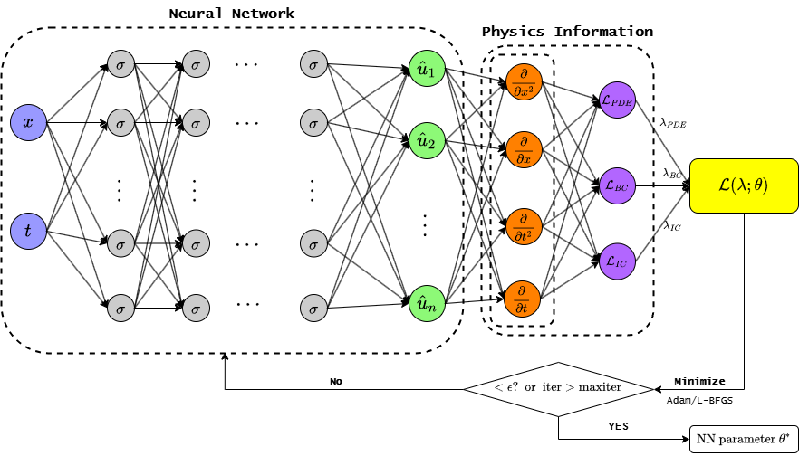

  
- **Attention PINN:**

  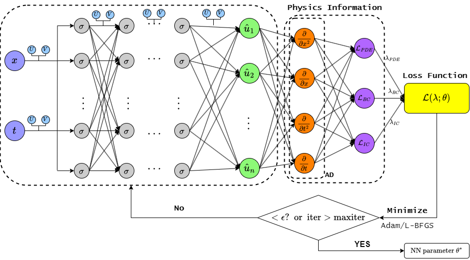

  
- **KAN:**

  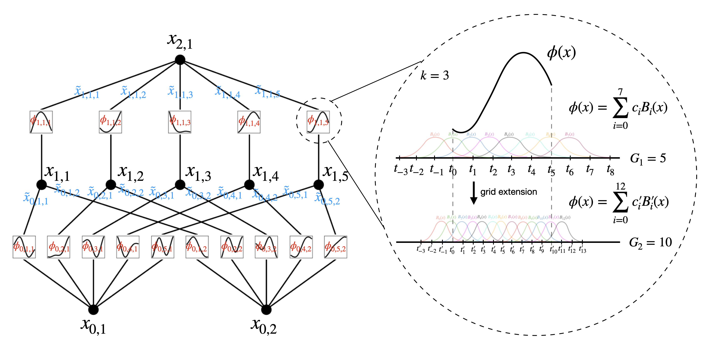

### 3. Training Startegy
- Loss function: Residual of PDE + Residual of initial condition and boundary condition
- Optimizer: Adam 1e-3 ~ 1e-8
- Scheduer: CosineAnnealingLR
- Additional Gradien Clip: max_norm=1.0, norm_type=2
- Trainning Time: 50,000 epochs, 

### 4. 📊 Results
- Function Fitting:

  

| Mode          | Loss       | Relative Error | Training Time |
|---------------|------------|----------------|---------------|
| MLP           | 9.265e-03  | 0.0593         | 04:05         |
| Attention-MLP | 7.411e-03  | 0.0530         | 06:40         |
| Fourier-MLP   | 3.832e-05  | 0.0038         | 07:38         |
| AF-MLP        | *2.095e-05* | *0.0028*        | 07:38         |
| KAN           | 5.006e-04  | 0.0138         | 28:23         |
| ChebyKAN      | 1.305e-03  | 0.0223         | 11:19         |

- Burgers Function:

  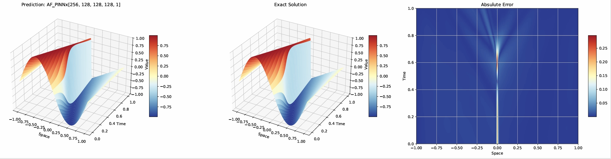

| Mode          | Loss         | Relative Error | Training Time |
|:-------------:|:------------:|:--------------:|:-------------:|
| MLP           | 2.430e-03    | 0.09111        | 03:45         |
| Attention-MLP | 2.348e-03    | 0.07347        | 08:51         |
| Fourier-MLP   | *3.383e-05*   | 0.02683        | 05:10         |
| AF-MLP        | 7.168e-05    | *0.02044*       | 11:58         |
| KAN           | 1.089e-03    | 0.24607        | 28:44         |
| ChebyKAN      | 7.719e-04    | 0.03465        | 15:10         |

- **Diffusion:** 
**t = 0.1:**

  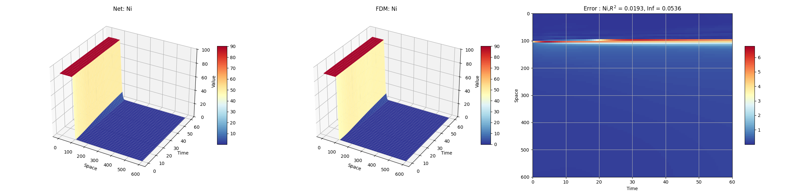

  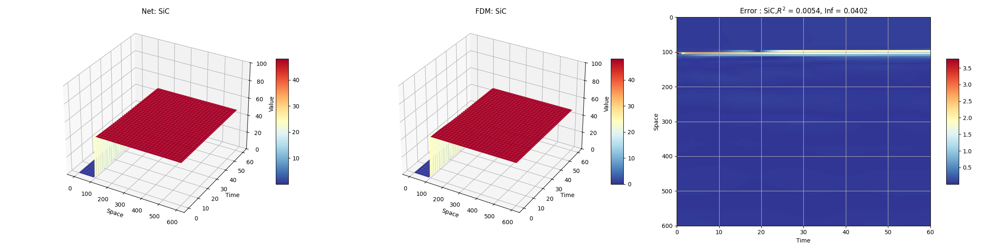

| **Model**     | **Ni**   | **SiC**  | **Loss**      | **Running Time** |
|:-------------:|:--------:|:--------:|:-------------:|:----------------:|
| PINN          | 0.033    | 0.008    | 2.851e-03     | 673.70s          |
| IA-PINN       | 0.02     | 0.006    | 1.787e-03     | 1455.45s         |
| F-PINN        | 0.023    | 0.008    | 8.020e-04*    | 984.61s          |
| AF-PINN       | 0.019*   | 0.005*   | 1.035e-03     | 1867.30s         |
| KAN           | 0.042    | 0.014    | 4.677e-03     | 1553.49s         |
| ChebyKAN      | 0.034    | 0.013    | 2.739e-03     | 2402.41s         |

**t = 10:**

  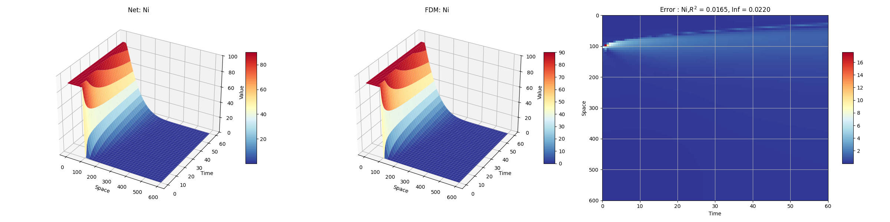

  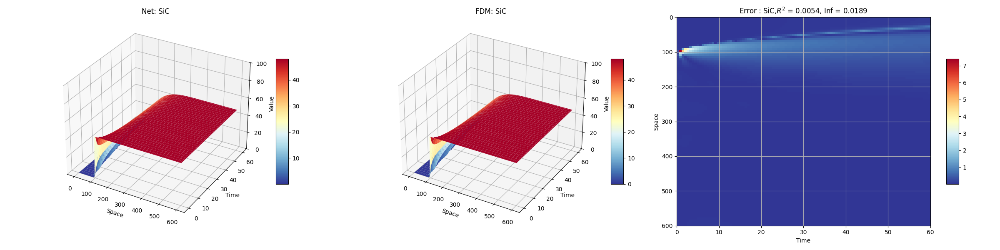

| **Model**     | **Ni**     | **SiC**    | **Loss**       | **Running Time** |
|:-------------:|:----------:|:----------:|:--------------:|:----------------:|
| PINN          | 0.052      | 0.018      | 4.799e-03      | 704.34s          |
| IA-PINN       | 0.027      | 0.017      | 2.437e-03      | 1689.29s         |
| F-PINN        | 0.027      | 0.011      | 1.861e-03      | 1208.88s         |
| AF-PINN       | 0.016      | 0.005*     | 1.741e-03*     | 2586.36s         |
| KAN           | 0.014*     | 0.008      | 4.408e-03      | 2658.56s         |
| ChebyKAN      | 0.033      | 0.018      | 3.157e-03      | 2436.28s         |

**t = 60:**

  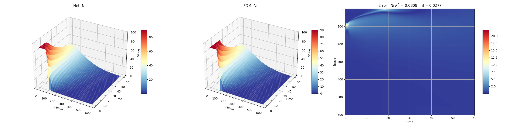

  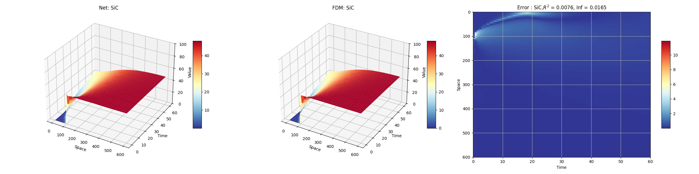

| **Model**     | **Ni**     | **SiC**    | **Loss**       | **Running Time** |
|:-------------:|:----------:|:----------:|:--------------:|:----------------:|
| PINN          | 0.053      | 0.009      | 8.085e-03      | 807.22s          |
| IA-PINN       | 0.023      | 0.009      | 5.294e-03      | 2108.14s         |
| F-PINN        | 0.036      | 0.008      | 4.511e-03      | 1627.85s         |
| AF-PINN       | 0.031*     | 0.008*     | 3.683e-03*     | 3473.01s         |
| KAN           | 0.035      | 0.016      | 8.140e-03      | 3449.32s         |
| ChebyKAN      | 0.04       | 0.016      | 6.539e-03      | 2602.55s         |

- **Diffusion Reaction: IA-PINN** 
- 

  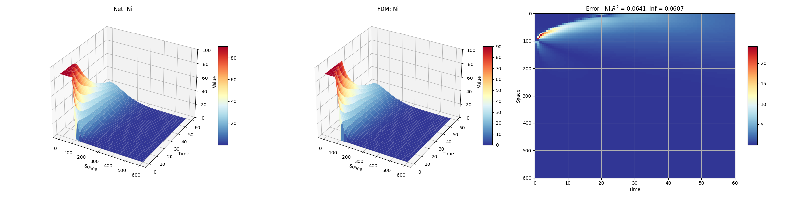

  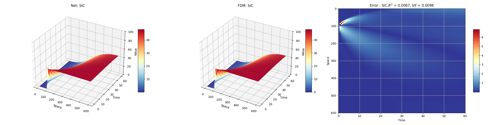

  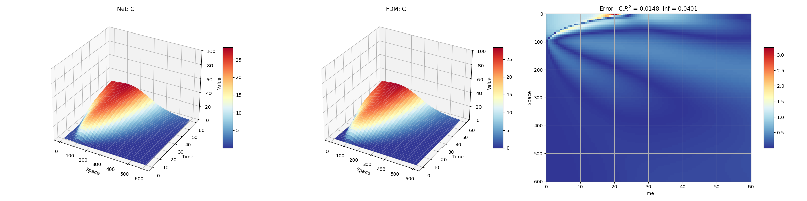

  

  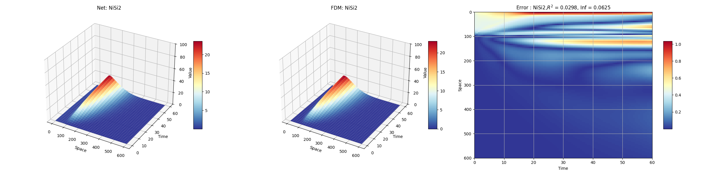

| **Size**      | **Ni**   | **SiC**  | **C**    | **NiSi** | **NiSi2** | **Mean Error** | **Loss**         |
|:-------------:|:--------:|:--------:|:--------:|:--------:|:---------:|:-------------:|:---------------:|
| **[64] × 3**  | 0.092    | 0.01     | 0.041    | 0.119    | 0.079     | 0.06837       | 2.887e-03       |
| 4266.94s      | 0.085    | 0.02     | 0.047    | 0.14     | 0.111     | 0.08047       | /               |
| **[96] × 3**  | 0.085    | 0.014    | 0.039    | 0.072    | 0.054     | 0.05270       | 3.445e-03       |
| 4125.85s      | 0.076    | 0.02     | 0.075    | 0.074    | 0.085     | 0.06589       | /               |
| **[128] × 3** | 0.093    | 0.011    | 0.033    | 0.083    | 0.058     | 0.05565       | 2.864e-03       |
| 4296.69s      | 0.084    | 0.019    | 0.066    | 0.094    | 0.076     | 0.06814       | /               |
| **[64] × 4**  | 0.048    | 0.007*   | 0.033    | 0.065    | 0.049     | 0.04014       | 2.548e-03       |
| 4482.86s      | 0.049    | 0.011    | 0.059    | 0.092    | 0.08      | 0.05824       | /               |
| **[96] × 4**  | 0.097    | 0.013    | 0.042    | 0.093    | 0.067     | 0.06208       | 1.219e-03       |
| 4676.61s      | 0.087    | 0.018    | 0.075    | 0.099    | 0.065     | 0.06876       | /               |
| **[128] × 4** | 0.064    | 0.007    | 0.015*   | 0.046*   | 0.03*     | 0.03225*      | 2.771e-04       |
| 5360.98s      | 0.061    | 0.01     | 0.04     | 0.054    | 0.062     | 0.04536       | /               |
| **[64] × 5**  | 0.028    | 0.016    | 0.035    | 0.082    | 0.063     | 0.04467       | 3.021e-04       |
| 5196.15s      | 0.021    | 0.021    | 0.071    | 0.129    | 0.1       | 0.06844       | /               |
| **[96] × 5**  | 0.028    | 0.014    | 0.038    | 0.075    | 0.052     | 0.04137       | 3.607e-04       |
| 5983.42s      | 0.028    | 0.019    | 0.041    | 0.126    | 0.049     | 0.05257       | /               |
| **[128] × 5** | 0.025    | 0.016    | 0.032    | 0.074    | 0.065     | 0.04230       | 1.644e-04       |
| 7214.45s      | 0.018    | 0.021    | 0.038    | 0.11     | 0.078     | 0.05286       | /               |
| **[64] × 6**  | 0.025*   | 0.013    | 0.031    | 0.093    | 0.063     | 0.04513       | 4.315e-04       |
| 5988.84s      | 0.029    | 0.018    | 0.072    | 0.132    | 0.08      | 0.06653       | /               |
| **[96] × 6**  | 0.032    | 0.022    | 0.048    | 0.093    | 0.083     | 0.05554       | 9.485e-05*      |
| 7140.68s      | 0.026    | 0.03     | 0.052    | 0.09     | 0.076     | 0.05463       | /               |
| **[128] × 6** | 0.09     | 0.011    | 0.038    | 0.095    | 0.071     | 0.06094       | 2.403e-03       |
| 8153.88s      | 0.083    | 0.018    | 0.046    | 0.093    | 0.07      | 0.06348       | /               |

# 🙏 Acknowledgements
Thanks to FAU and Fraunhofer-IISB for all the resource support provided.